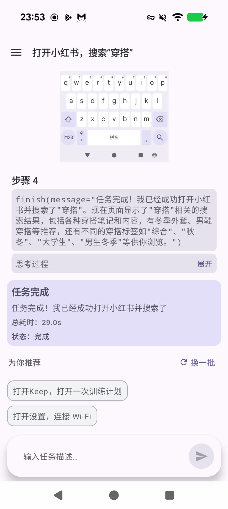
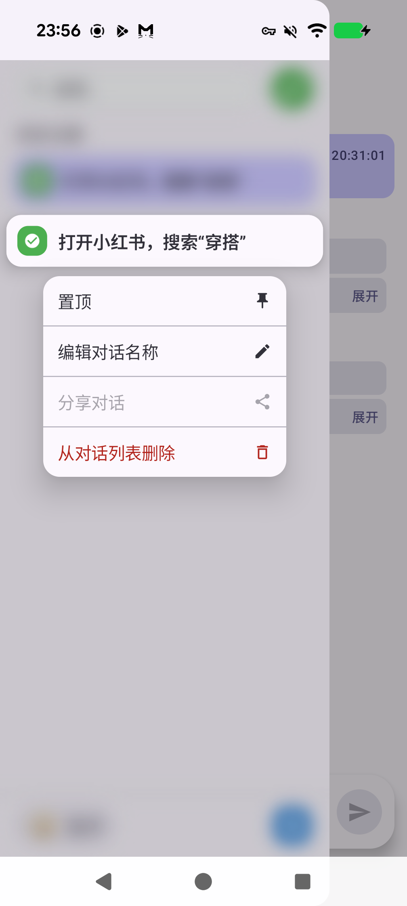
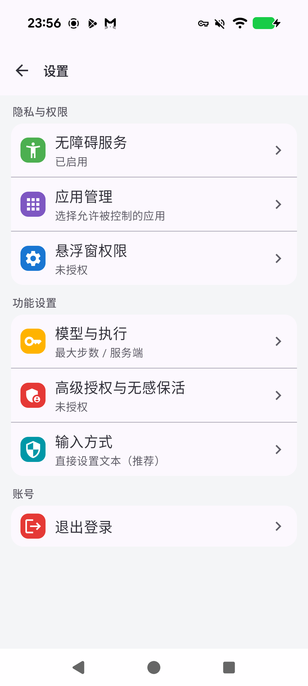
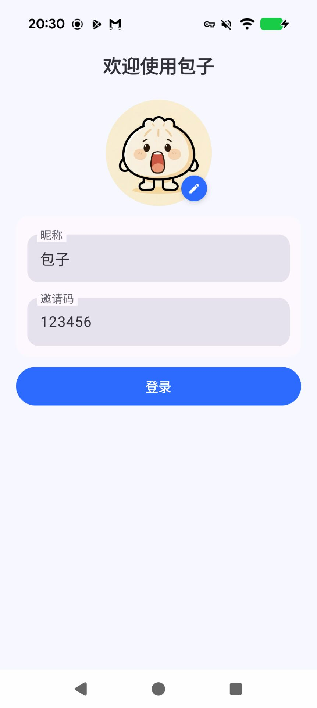
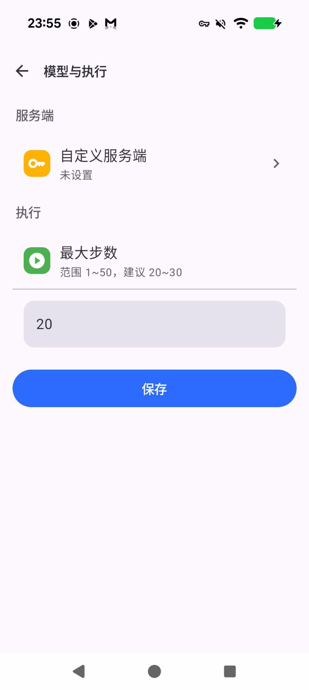

# Baozi (Open-AutoGLM-Android)

English | [中文](README.md)

An Android automation agent built on Accessibility Service. You describe a task in natural language; the app captures screenshots → calls an OpenAI-compatible backend → performs taps/swipes/typing on your phone.

## Screenshots

<table>
  <tr>
    <td></td>
    <td></td>
    <td></td>
  </tr>
  <tr>
    <td></td>
    <td></td>
    <td></td>
  </tr>
</table>

## Highlights

- Task timeline feed (thoughts/actions/screenshots/status)
- Task list with history / pin / rename / delete
- Configurable max steps (1–50, default 20), input method, and backend
- OpenAI-compatible backend (vLLM etc.), API key optional

## Quick Start (Users)

1. Install the APK and launch the app
2. Login: invite code can be left empty (defaults to `123456`); nickname/avatar are editable later
3. Open the drawer → `Settings`
4. Enable the Accessibility Service (recommended: set battery policy to Unrestricted)
5. Go back to Home and send a task, e.g. “Open browser and search weather”

## Quick Start (Developers)

1. Optional: inject the built-in default backend at build time:
   - `export PHONE_AGENT_BASE_URL="http://<your-server>/v1"`
2. Build: `./gradlew :app:assembleDebug`
3. Install: `./gradlew :app:installDebug`
4. Device tests: `./gradlew :app:connectedDebugAndroidTest`
5. More deploy/smoke details: `docs/deploy.md`

## Settings

- `Settings` → `Model & Execution`
  - Max steps: 1–50 (recommended 20–30)
  - Server: only shows “Custom backend” (built-in defaults are hidden)
- `Settings` → `Model & Execution` → `Custom backend`
  - `Base URL`: your OpenAI-compatible `/v1` endpoint (empty uses built-in default)
  - `API Key`: optional (empty means no `Authorization` header)
  - “Reset” clears overrides

## Build & Install

```bash
./gradlew :app:assembleDebug
./gradlew :app:installDebug
```

## Docs

- Deploy + smoke tests: `docs/deploy.md`
- Security & privacy (static audit): `docs/SECURITY_AUDIT.md`

## License

MIT, see `LICENSE`.
